Você entra em uma sala, observa vários computadores em uma bancada sendo formatados, CDs/DVDs espalhados para todo lado, uma pessoa pulando de computador em computador inserindo seriais. 

Continua observando por mais um tempo, o primeiro pc termina a instalação, a pessoa que antes inseria a serial diligentemente começa a catar os CDs/DVDs de instalação dos aplicativos destinados à máquina em questão (editores de texto, de imagem, etc). 

O processo se repete nos outros computadores da bancada, no mesmo momento que você repara que ainda existem outros tantos computadores em espera ao lado da bancada, empilhados uns sobre os outros. Nesse momento o pensamento ocorre “esse cara aí não vai sair daqui tão cedo”.

Essa descrição de cenário lhe soou familiar? Em algumas pessoas com mais experiência no mundo do suporte técnico, ela chega a causar calafrios. Contudo, o que era comum há muitos anos atrás, não precisa mais ocorrer. 

Em ambientes automatizados, onde há uma gestão de recursos mais experiente e voltada a eficiência, são lembranças de um passado amargo e não mais necessário. 

Agora imagine a seguinte situação, a formatação de um laboratório de 40 máquinas idênticas (por formatação eu refiro a: instalação do sistema operacional, instalação dos aplicativos do laboratório, configuração dos usuários, limpeza dos temporários, e ativação das licenças).

No cenário do balcão, com vários computadores, levava em média uma semana de trabalho. Com o uso da ferramenta de automação, que relatarei neste texto, o tempo foi reduzido para em média 5 horas (totais), para estas mesmas 40 máquinas.

Neste texto pretendo explorar a implementação de uma ferramenta muito interessante (e útil) que está em utilização onde trabalho atualmente. Como responsável por essa implementação em meu ambiente de trabalho, aproveitarei a criação da documentação de implementação dela para criar um caso de uso para mais pessoas possam também aproveitar este belo aplicativo (que é open source) em seu ambiente de trabalho. 

Isto dito, me acompanhe nesta recompensadora jornada que é a implementação do <b>FOG Project</b>.

## O que é o tal do FOG Project?

Bom, de uma forma muito, resumida podemos dizer que ele é um gerenciador de imagens e sistema de “formatação” de computadores via rede. Seguindo a seguinte sequência lógica:

1. Existe um computador com o sistema operacional instalado limpo, os aplicativos padrões, estruturas de pastas pronta. Ainda não utilizado pelo usuário final, que será usado como matriz;
2. Captura-se uma imagem deste computador utilizando o Fog. Esta imagem ficará armazenada no servidor do Fog e será utilizada para criação de novos computadores de modo a ficarem com a mesma instalação que o computador matriz. Conseguindo assim, padronização de instalações;
3. Em outros computadores, preferencialmente, mas não necessariamente iguais ao modelo do computador matriz, se faz o despejo desta imagem via PXE (rede);
4. O fog efetuará a formatação, instalação e adequação do novo computador durante o processo de despejo (deploy) da imagem base. 

Agora numa forma prolixa e detalhada:

O fog é uma ferramenta de automação de clonagem para computadores via rede, com um sistema de gerenciamento destas imagens com interface muito amigável via navegador. 

Tem <b>custo zero</b> (esse ponto é importante em tempos de enxugamento de receitas e a TI infelizmente ainda sendo encarada como custo e não como investimento).

Entre suas principais características, as que eu gosto de notar são suas capacidades de ser altamente escalável com o uso de Nodos de Armazenamento (Storage Nodes), a possiblidade de instalação remota de aplicativos via snapins, possiblidade de alteração e controle de configurações do pc remotamente através do cliente Fog, quando ele está instalado na máquina alvo, entre tantas outras funcionalidas adicionadas através de plugins (localização, setorização de computadores em grupos vinculados à storages remotos), etc. 

Progressão da automatização e resultados/benchmarking:

* começo com bancada cheia de pcs = Média de 1 semana para um laboratório de 40 computadores de mesmo modelo, considerando apenas uma pessoa executando todo processo e dependendo da capacidade operacional da bancada;
* uso do ghost via hirens boot disk + hd externo = 2 a 3 dias, considerando apenas uma pessoa executando todo processo e dependendo da velocidade de acesso do hd externo;
* uso do Fog com imagens padronizadas = Média de um turno (4~6 horas) para padronizar 40 computadores em um laboratório[^1].

[^1]: este tempo pode ser reduzido com uma infraestrutura de rede que comporte um throughput alto, no meu cenário que tem certas limitações orçamentárias atingimos essa marca média, limite de 40 computadores por vez pelo limite técnico de capacidade de hardware do servidor utilizado aqui no setor;

## Download e instalação

Explicações feitas sobre o cenário de uso do fog, vamos agora botar a mão na massa e entender a instalação do aplicativo.

Aqui estou assumindo que alguns requisitos já estejam contemplados para instalação:
* Alguma variante de linux no servidor, devidamente atualizada (estou utilizando Debian nestes exemplos);
* Servidor devidamente conectado à internet;
* Ter o GIT instalado previamente para efetuar a cópia dos arquivos de instalação mais recentes diretamente do repositório do projeto;
* <b>NÃO</b>, eu disse, <b>NÃO</b> criar um usuário chamado "fog". Este ponto é importante, pois se o usuário fog já existir no sistema operacional, algumas alterações de arquivos de configuração e de detalhes dentro do sistema serão necessárias para que tudo ocorra perfeitamente.

<b>Alguns avisos prévios sobre o meu ambiente de uso:</b>
Já possuo um servidor DHCP em uso, fornecido por terceiros, portanto não utilizarei esta funcionalidade fornecida pelo FOG Project;

<b>Aviso importante</b>: execute todos os passos a seguir como usuário root, utilizando `sudo su` ou `su -l`

Efetuamos a clonagem dos dados de instalação do FOG Project a partir do seu servidor oficial, usando a ferramenta git.

`git clone https://github.com/fogproject/fogproject.git fog_stable/`

Entramos no diretório criado:

`cd fog_stable/bin`

Enfim, executamos o script de instalação:

`./installfog.sh`

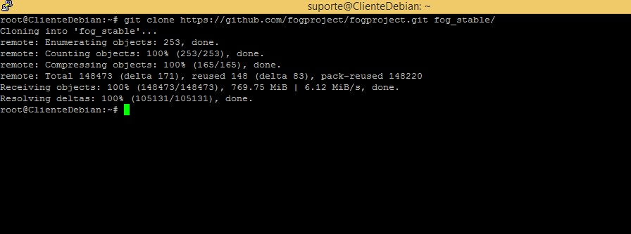

A próxima etapa é configurar o FOG de acordo com a sua necessidade. Aqui eu coloco as capturas de tela de todas as etapas do processo de instalação e configuração do FOG em um servidor.

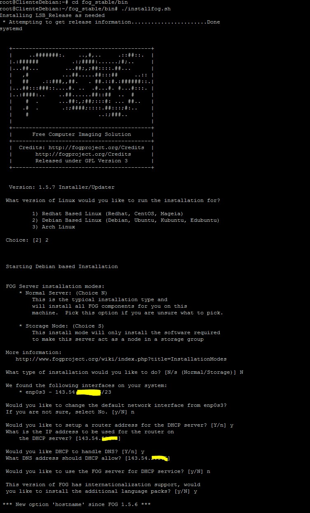
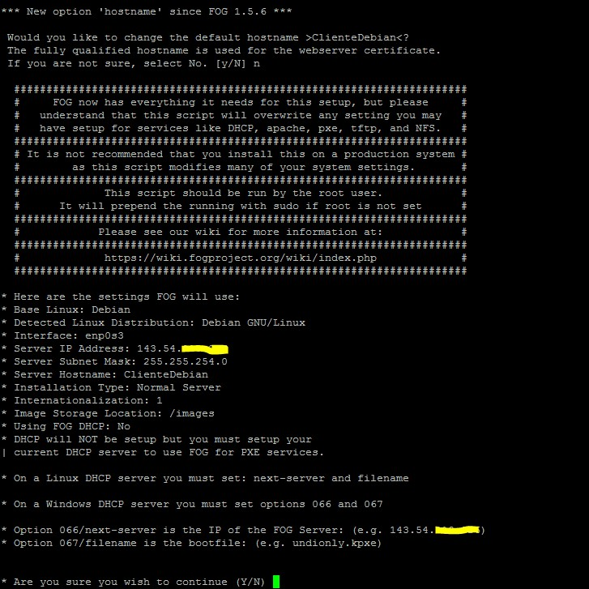
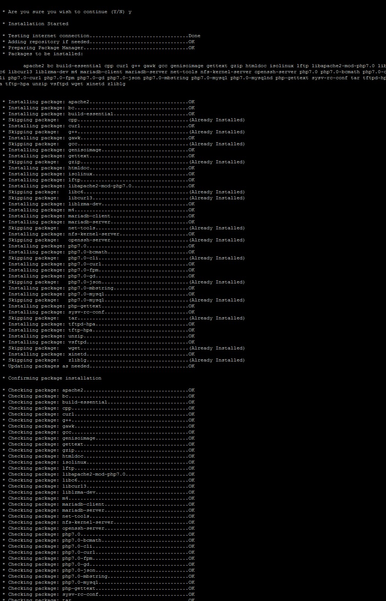
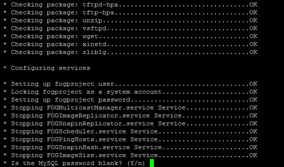
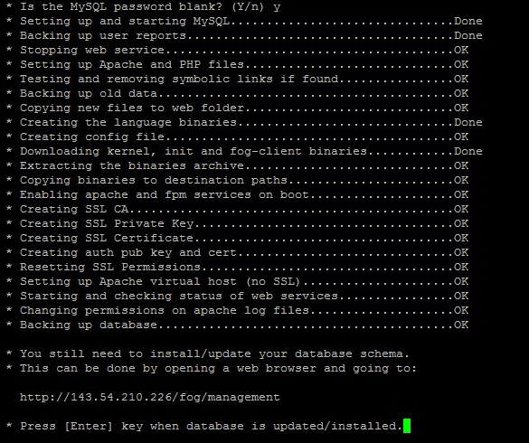

Por fim, abra um browser e acesse o endereço de acordo com o IP do seu servidor de imagem (FOG SERVER):
http://<b>[IP do servidor]</b>/fog/management
Clique em "Install/Upgrade now". Conforme demonstra a próxima imagem.

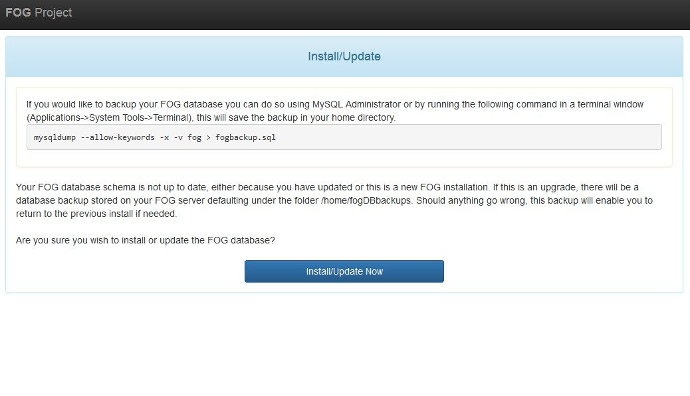

Após a confirmação da instalação do banco de dados, retorne à linha de comando e pressione a tecla <b>enter</b>.

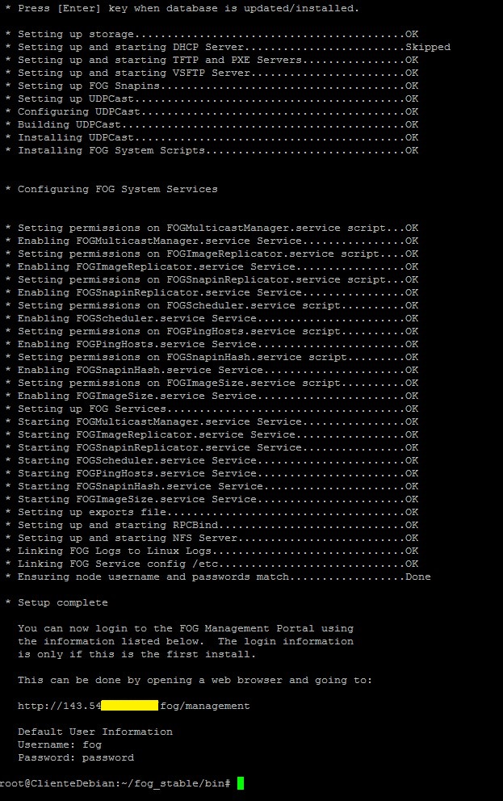

Ao finalizar a instalação será informado o usuário e a senha inicial para acesso ao sistema web.

Pronto! Seu servidor de imagens já está operante, falta apenas configurar o seu servidor DHCP. 

Como referi anteriormente, utilizo o serviço DHCP de outro setor aqui na universidade. De modo que é necessario que você veja com seu provedor de DHCP como proceder para configurar 

Contudo, se você não tiver um serviço de DHCP no seu ambiente, poderá utilizar o fornecido pelo proprio Fog, apenas confirmando essa opção durante as etapas da instalação.

No PfSense, por exemplo, a configuração seria conforme a figura abaixo (alterando-se os endereçamentos IP conforme seu ambiente).
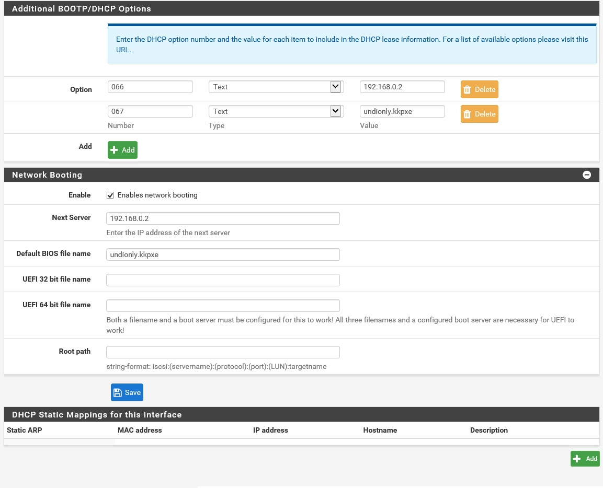

No meu cenário, onde existe um NAC (Network Access Control) fornecendo o serviço de cadastro de DHCP para os usuários, eu apenas configuro para qual IP a maquina em questão será apontada como um servidor de PXE e digo qual tipo de kernel ela esperará. Conforme imagem abaixo.
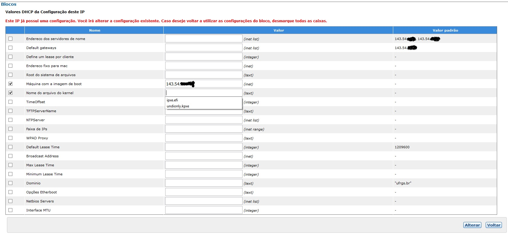

Observe que há duas opções de arquivo de kernel na minha solução. Isto se dá pois cada kernel é feito para suportar um tipo de boot, o <i>undionly.kpxe</i> para os modos BIOS/Legacy e o <i>ipxe.efi</i> para as placas de rede mais modernas que conseguem fazer Pxe via EFI (e lidar com arquivos mais robustos durante a transferência de imagem, entre outras funcionalidades).

## Utilização do FOG após finalizada instalação e configuração do ambiente.

Agora começa a diversão, vamos ver como usar as funcionalidades básicas do sistema. Ao fazer login no sistema a primeira tela que você verá será a dashboard do Fog.

Como podemos observar, a interface do Fog é bem limpa e intuitiva, ép possível notar o tempo de uptime do servidor, quantos slots de conexão estão disponíveis/uso para capturas/deploy, o uso da capacidade de armazenamento do servidor, histórico das últimas utilizações e um monitor do tráfego na rede.  

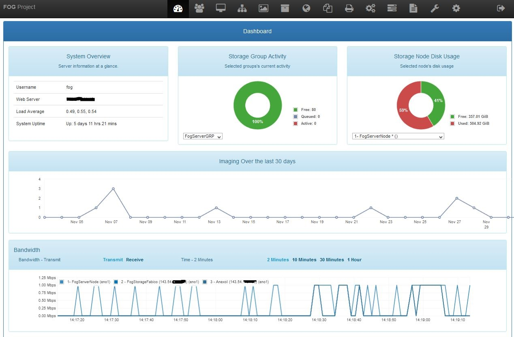

Clicando no quinto ícone no menu superior acessamos a tela de cadastro/edição de imagens. É aqui que criaremos o protótipo básico da imagem que sera capturada do computador matriz. Note porém, que aqui não há imagem de fato no servidor, apenas a descrição do que ela será no banco de dados, a imagem só existirá após a captura do pc matriz.

Na primeira imagem observamos a tela de criação de uma imagem, na tela seguinte mostro uma imagem já criada para o uso, usando dados esperados para um computador padrão destinado aos professores da unidade.

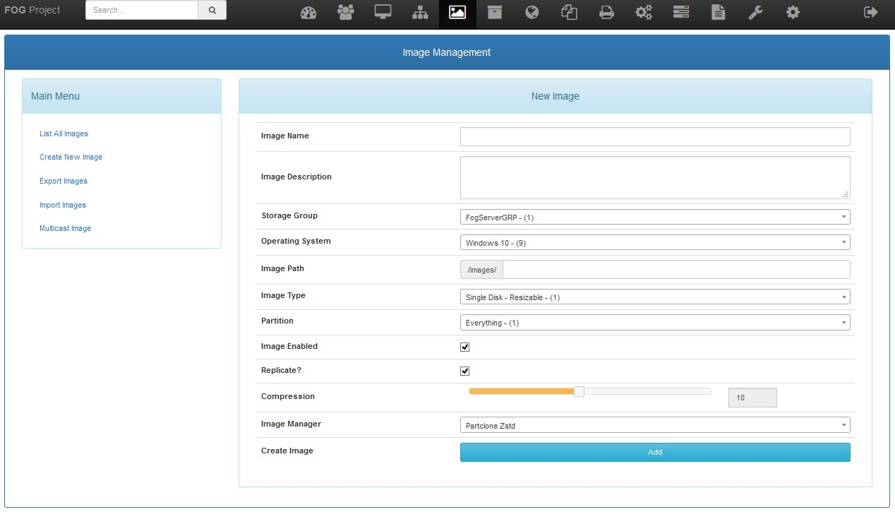
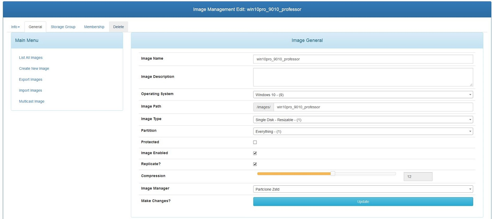

Com a descrição de imagem criada e adicionada ao banco de dados, é momento de registrar um computador para que ele consiga <i>ser visto</i>  pelo Fog. Na imagem abaixo vemos os detalhes de um computador que já existia aqui no meu ambiente e que usarei para demonstrar a captura e deploy da imagem.

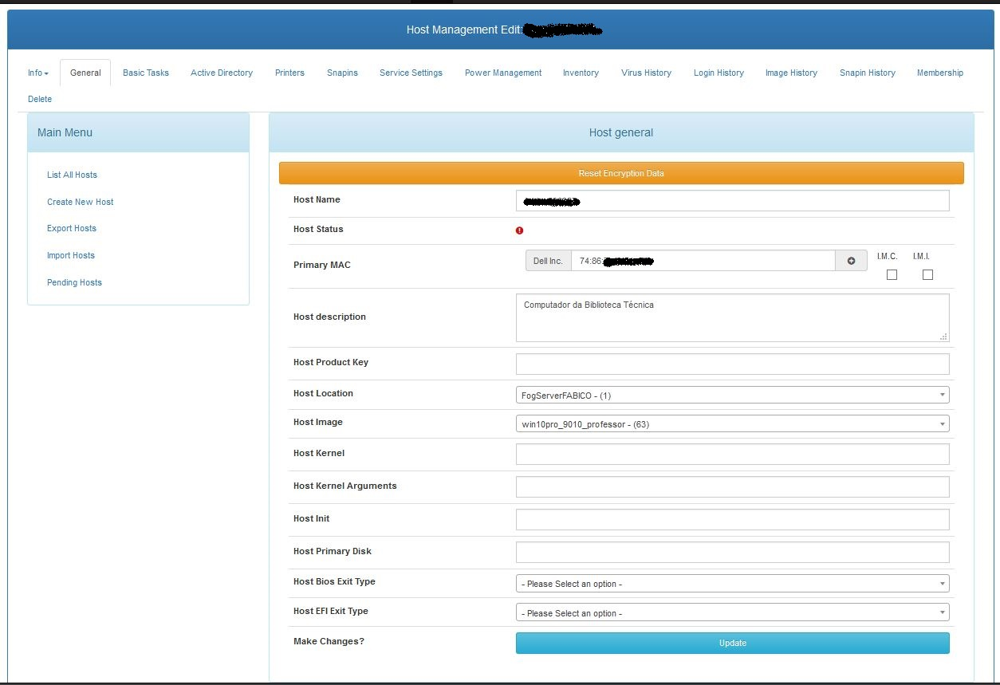

Como podemos observar, o computador (host) é mapeado pelo seu endereço físico (MAC ADDRESS), o DHCP direciona este MAC para o Fog, o Fog verifica que ele existe em sua base de dados e a partir daí podemos executar tarefas (tasks) com esse computador. 

Observe também que a imagem criada no passo anterior foi a designada para este host no campo <i>Host Image</i>. Após finalizado o cadastro, podemos acessar a aba <i>Basic Tasks</i> que é demonstrada na imagem seguinte.

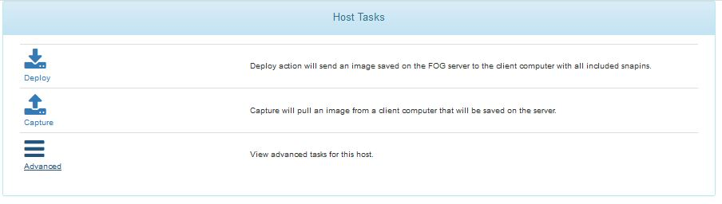

Aqui podemos efetuar as duas tarefas básicas inerentes ao Fog, Captura e Deploy. E temos acesso a várias tarefas avançadas. como por exemplo, modo debug (que exige a confirmação em cada etapa da captura/deploy para mapear possível erro), snapins (que é uma funcionalidade interessante quando usada com o fog client, para instalação remota de aquivos msi), entre outras.

Ao clicar em capturar e confirmar, o computador matriz irá ligar automaticamente se a opção de boot remoto (pxe) e acordar pela rede (Wake On Lan) estiver habilitada na BIOS/EFI do computador. Lembre-se também de deixar a rede como primeira opção de boot nas configurações da BIOS.

Se tudo estiver configurado corretamente no computador matriz, ele fará boot pela rede, chamará o Fog remotamente e começará o processo de captura da imagem do computador. Como demonstrado na imagem seguinte.

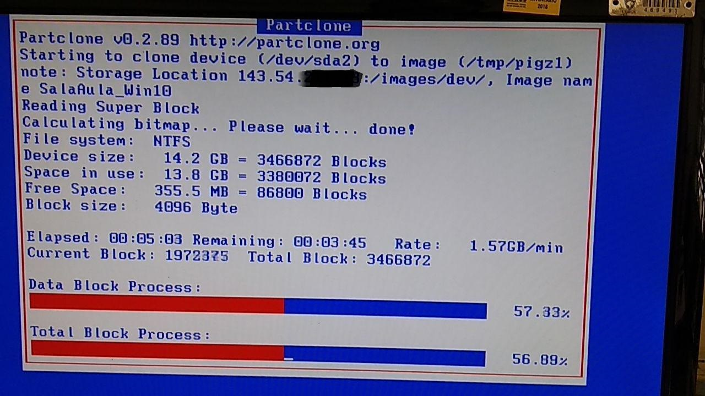

Após a captura ser completada, seguindo a mesma instrução acima somente mudando para opção deploy, o computador fará o mesmo processo. Porém, para devolver a imagem capturada anteriormente para esse computador (equivalente a uma formatação total do pc e instalação do sistema operacional capturado + softwares que existiam no pc matriz no momento da captura). 

Podemos ver o processo de deploy na imagem seguinte. Note o tempo estimado de conclusão, quando é apenas um computador efetuando o deploy, compare este dado com a espectativa de tempo de formatação + instalação de aplicativos no modo tradicional, com CD/DVD e downloads.

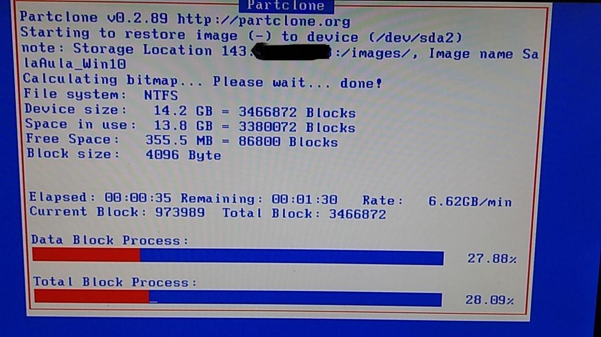

Aqui demonstro uma tela acessada via boot remoto (Pxe) onde é possivel efetuar alguns dos comandos básicos sem depender da interface web. Efetuar o cadastro rápido de uma máquina previamente mapeada no DHCP. Observe que há alguns itens de manutenção, estes itens foram adicionados por mim, como o Hiren's boot cd por exemplo. Com o Fog é possível efetuar o boot de uma imagem de cd (iso) ou o instalador do windows (arquivo WIM) remotamente.

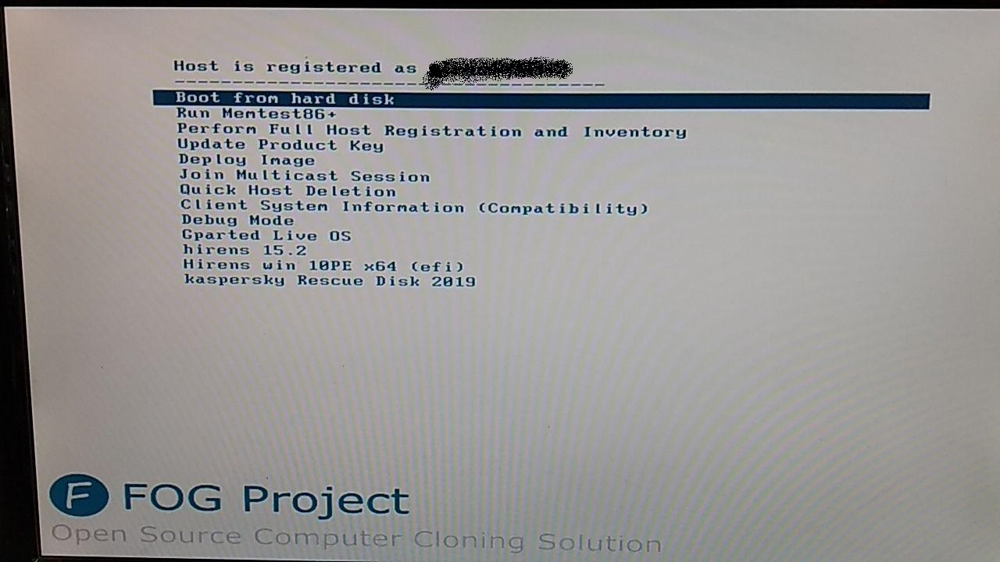

E assim finalizo esta breve introdução à ferramente FOG Project, o que mostrei aqui é apenas o básico do básico que ela oferece, vá à documentação do Fog nos links de referência que disponibilizei no final do texto e explore. Esta ferramenta lhe poupará muitas horas de retrabalho.

Lux in Tenebris:. Saudações. 93!

Referências:

<a href="https://forums.fogproject.org/">https://forums.fogproject.org/</a>  
<a href="https://wiki.fogproject.org/wiki/index.php?title=FOGUserGuide">https://wiki.fogproject.org/wiki/index.php?title=FOGUserGuide</a>  
<a href="https://www.vivaolinux.com.br/artigo/FOG-Project-Configurando-meu-primeiro-servidor-de-imagens">https://www.vivaolinux.com.br/artigo/FOG-Project-Configurando-meu-primeiro-servidor-de-imagens</a> (imagem para configuração do PfSense)  
<a href="https://www.linkedin.com/posts/marioneis_automatizando-e-reduzindo-o-tempo-de-manuten%C3%A7%C3%B5es-activity-6608065959330672641-m2fX">Postagem no meu perfil do LinkedIn</a> 

Se você utilizou o FOG e gostou, pague uma "cerveja" para os criadores. 
O FOG é grátis, mas seus criadores e mantenedores merecem um agrado pelo esforço colocado em seu tempo livre.
<a href="https://fogproject.org/donate">https://fogproject.org/donate</a>
