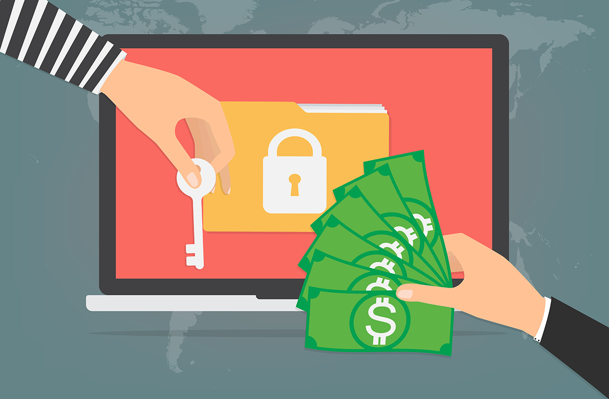

## O que é o sequestro de dados (RansomWare) e como se proteger.

Nas últimas semanas, os fóruns e listas de conversa de cibersegurança andam aventando que 2020 será um ano com uma nova onda de RansomWares. 
Ciente do risco que muitos usuários sem conhecimento técnico correm, e da efeméride de 30 anos dos primeiros casos de RansomWare registrados, contarei aqui um pouco sobre o que é afinal de contas essa ameaça cibernética e sugerir algumas formas de você se proteger para que os danos sejam os menores possíveis.

Antes de mais nada é preciso frisar uma questão importante:  <b>“1 backup NÃO é backup”</b>. 

Se você é do reino da TI certamente já ouviu essa frase pelo menos uma vez, se não for, talvez ela não faça muito sentido agora,  mas calma, ela fará até o final deste texto.

## Um pouco de história

O que hoje é uma das grande ameaças à segurança cibernética do mundo, começou de uma forma muito menor. Em dezembro de 1989 ocorreu um um dos primeiros ataques bem sucedidos deste formato e ele iria influenciar os maiores ataques cibernéticos de hoje.

Hoje esse ataque é conhecido como o Trojan AIDS, porque o alvo dele era a conferência da OMS sobre AIDS em Estocolmo em 1989. Neste ataque os participantes da conferência receberam disquetes contendo código malicioso que infectaria os MS-DOS onde fossem utilizados, efetuando uma contagem de vezes a ser utilizado. 
Quando essa contagem chegava ao número 90, o trojan esconderia todas as pastas e arquivos e criptografaria os nomes de todos os arquivos no disco rígido, o tornando não mais acessível. 

Apareceria então uma nota assinada por “PC Cyborg Corporation” que diria que o empréstimo do software teria expirado que seria necessário o envio de 189 dólares a um endereço no Panamá para que o acesso ao sistema fosse readquirido.

Era um pedido de resgate para que um pagamento fosse feito de modo a vítima poder recuperar o acesso ao seu computador. Era o primeiro ransomware.

Para a sorte dos afetados, a criptografia utilizada por esse trojan à época era bastante fraca, então pesquisadores matemáticos e criptoanalistas foram capazes de bolar um aplicativo de descriptografia.

Depois de alguns anos surgiu um novo ataque muito comum (ainda acontece atualmente aqui e ali) que é o “Police Locker Attack”, que acontece muito comumente através de downloads de arquivos maliciosos /infectados feitos em redes piratas, sites comprometidos e em sites de material onanístico/fappável.

Ele alterará a área de trabalho do usuário para uma nota informando que a força policial trancou o acesso ao seu computador por suspeita de atividades ilegais. Podemos conferir diferentes tipos de mensagens que esse tipo de ataque gera (de acordo com a nacionalidade do atacado… divertido não?) na animação abaixo.

Felizmente este ataque em específico não utiliza criptografia alguma na maioria das vezes, é um ataque que conta com a inexperiência e medo do usuário com a mensagem ( o famoso efeito cagaço) e este acaba pagando algumas centenas de dólares ao atacante.
Porém nem tudo são flores e o chavão “para cada chaveiro pensando em um novo cadeado tem 4 ladrões pensando em uma chave mestra” é verdadeiro em muitas situações da segurança cibernética.

Após um pico de “police lockers” entre 2010 e 2012, eles não desapareceram. Eles evoluíram para Ransomwares ‘reais’.

Alguns autores colocam a janela de tempo entre 2012 e 2014 como “o velho oeste” dos ransomwares, pois a ideia de um sequestro de dados para o público em geral era novidade e eles não estavam cientes do que era e não tinham entendimento do real perigo que ele oferecia. “Existia de tudo entre simples bloqueadores de área de trabalho até aos mais refinados criptografadores de dados” Michael Gillespie, pesquisador ransomware na Emsisoft

Então chegamos à 2015  e uma coisa muda o jogo: começam a se popularizar as criptomoedas. Antes os pagamentos deveriam ser feitos em moeda padrão, de fácil rastreabilidade. Agora os pagamentos são exigidos em moedas virtuais que são muito mais difíceis de seguir, fazendo aqueles por detrás do ataque mais difíceis de serem descobertos.

As coisas continuaram relativamente estáveis (sim, palavra ruim para o cenário, mas é a correta) dentro da métrica de ataques, eles sempre mirando corporações, entidades pública e afins, ataques que se não parassem algum atendimento público não entrariam nas manchetes alvo do grande público.

Contudo, chegamos ao mês de maio de 2017. Aqui a coisa ficou feia...Entra em cena o famoso “wannaCry”.

Naquele mês, pessoas em organizações (públicas e privadas) em todo mundo, se depararam com uma mensagem pedindo o pagamento de resgate em troca da recuperação segura de seus arquivos. Seria mais uma terça feira comum no mundo dos sequestros de dados, se a promessa fosse verdadeira…. WannaCry estava sendo espalhado ao redor do globo com ajuda de uma ferramenta vazada da NSA chamada EternalBlue. 

Mesmo organizações que pagaram o resgate não conseguiram seus dados de volta, não havia mecanismo para recuperar os dados no ataque (hoje o ataque é visto como de natureza puramente destrutiva).

O dano seria ainda maior se pesquisadores de segurança não tivessem encontrado um mecanismo interno do ransomware que desabilitava o ataque, que mais tarde teria sido indicado que era criado pela Coréia do Norte.

Apenas algumas semanas após outro ataque similar aconteceu. Chamado de “notPetya”, é considerado um ataque lançado pelo serviço de inteligência militar da Rússia. Atingiu vários alvos ao redor do mundo (teve como foco inicial alvos na Ucrânia, mas acabou por se espalhar). Apesar de se mostrar como um ransomware, ele agiu como uma ferramenta de destruição remota.

Estes ataques se mostraram extremamente lucrativos e a despeito dos números envolvidos (algumas vezes o resgate chega a 6 dígitos), muitas organizações optam por pagar. Algumas vezes o pagamento é feito por ser um “mal menor” haja vista que recolocar de pé toda uma organização que teve um servidor sequestrado demandaria tempo e esforço que poderia passar largamente o custo do resgate em si.

Até aqui já sabemos como começou e como chegou até aqui, vamos às partes suculentas do negócio.

## Algumas definições

Vamos voltar à vaca fria. Ransomware em português simples e claro é o sequestro do seu computador. Quando um criminoso utiliza criptografia para lhe obrigar a pagar uma quantia (normalmente em bitcoins) de resgate pela senha para descriptografar seus dados.

Usando uma analogia bem tosca mas funcional, imagine que todos documentos que você tem em papel sejam roubados por alguém e colocados dentro de uma pasta protegida por aquelas senhas numéricas. Esta pasta é deixada no meio da sala de estar da tua casa com um bilhete “coloque 10 mangos na caixa postal X em até 3 dias que lhe enviarei uma carta com a senha da mala com teus documentos”.

Num primeiro momento você deve ter pensado “ah.. mas mete um pé de cabra na mala e pega os arquivos..” bom, aqui temos um problema, essa mala é feita de um material “da nasa” não tem como abrir na marretada, só resta abrir via senha. E esta, diferentemente da pasta usual com 4 ou 5 dígitos numéricos, é composta de todos tipos de caracteres e usualmente tem muitos caracteres.

Isso quer dizer que, matematicamente falando, uma quebra de senha levaria muito tempo e demandaria alto poder de processamento para ser efetuada. Em se tratando de “resgate” tempo não é uma possibilidade.

Isto posto, e com o retorno financeiro atraente (infelizmente muitos pagam o valor requisitado), muitos atacantes continuam aprimorando as famílias de ransomware. As famílias *Sodinokibi* e *Nemty*, por exemplo, estão evoluindo para o modo RaaS (ransomware como um serviço em inglês) e ganhando terreno.

Cibercriminosos estão distribuindo o *Sodinokibi* de formas diferentes, incluindo o uso de exploit kits, emails falsos (<a href="https://marioneis.github.io/essays/pharming.html">phishing</a>) e utilizando vulnerabilidades de aplicativos instalados.

Ao utilizar o modelo RaaS, os criadores de malwares do tipo do *Sodinokibi* e *Nemty*, diminuíram significativamente o nível de pré-requisitos para os ataques acontecerem. E esta baixa no nível faz esse tipo de cibercrime ser muito mais acessível e lucrativo para uma gama maior de agentes maliciosos.

## Algumas sugestões para proteção dos dados

Enquanto emails maliciosos forem o principal vetor de ataque, você deve prover treinamentos específicos para as pessoas de sua organização em como notar que um email não é verdadeiro. Essa política de treinamento em verdade não só protegerá contra ataques de sequestro de dados, mas também com outros ataques.

Uma possibilidade é o setor de TI da empresa criar um ambiente seguro onde os empregados possam “cometer erros” para aprender durante sua tomada de decisões. A gamificação torna o aprendizado mais leve.

Desabilitar  e bloquear a possibilidade do usuário reabilitar o uso de macros em planilhas/emails não verificados.

Invista em um software antivírus de qualidade e o mantenha atualizado e ativo. De modo a ele avisar o usuário sobre arquivos potencialmente maliciosos.

Mantenha todos os sistemas atualizados com patches de segurança e atualizações disponíveis.

Crie uma metodologia de backup. Backups completos de tempos em tempos e incrementais diários são uma boa pedida.

Mantenha backups offline em um armazenamento separado como parte do plano de recuperação de dados. Estes backups devem trabalhar em paralelo com backups online  que são os de uso do dia a dia da empresa. Tenha em mente sobre a necessidade do backup offline em local diferente, pois um sequestro de dados pode afetar o acesso ao backup que esteja online e conectado à sua rede interna. (lembrou do "1 backup não é backup"?)

Mantenha políticas de verificação do estado do backup, tenha certeza que eles são fiáveis e estão acontecendo corretamente nos agendamentos.

Crie políticas firmes quando há a opção de trazer seu próprio dispositivo para o trabalho. O dispositivo deve passar por inspeção prévia por parte do setor de segurança da informação da empresa e deve-se ter um calendário rígido de reavaliações.

Crie políticas de lista de aplicativos habilitados, sendo que somente estes aplicativos estarão disponíveis para o uso nas estações de trabalho.

Utilize o sistema de credenciais disponibilizado nos dispositivos. Usuários devem ser usuários. Administradores devem ser administradores. Grande maioria dos problemas em geral ocorrem em computadores onde o usuário está com prerrogativas de administrador, de modo que um arquivo malicioso poderá acessar os arquivos de sistema sem problemas neste cenário.
Efetue testes práticos e instrutivos com os funcionários da empresa (como há treinamentos para o caso de incêndios, deve haver o planejamento e o treinamento adequado para o ataque cibernético).

Segmente a rede em zonas de segurança, isso ajudará a prevenir que uma ameaça se espalhe pela rede para outros setores da sua organização. Ao acontecer uma quebra de segurança isola-se aquela rede do restante da organização.

Use as ferramentas de análise forense disponíveis em um cenário pós-ataque, de modo que você consiga identificar a origem da infecção, quão longo foi o tempo de infecção do ambiente, garantir que ele foi removido de todos os dispositivos que possam se conectar à rede e finalmente garantir que a infecção não aconteça novamente.

Os ataques de sequestro continuarão a evoluir, portanto é crucial que a cultura de proteção e o entendimento dos funcionários sobre como agir contra estas ameaças esteja sempre atualizada e em operação.

Lux in Tenebris:. Saudações. 93!

## Referência:
<a href="https://threatpost.com/ransomware-family-10-ways-take-action/151080/">threatpost</a>  
<a href="https://www.zdnet.com/article/30-years-of-ransomware-how-one-bizarre-attack-laid-the-foundations-for-the-malware-taking-over-the-world/">ZDnet</a> 

imagens: kasperskydaily.com e zdnet.com

